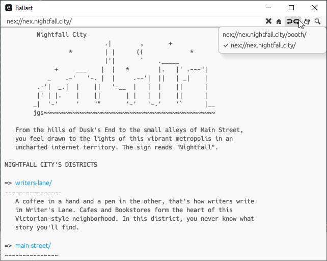

# Ballast

Ballast is a graphical [Nightfall Express](https://nightfall.city/nex/info/specification.txt)
client written using [egui](https://github.com/emilk/egui).

It is very basic, but it _does_ work. I've even successfully used Ballast
to further develop Ballast, as opposed to loading a mirror of Nightfall Express
pages in a browser.

Right now, text files and directories are displayed. Back and forward, cancel,
and return to [home](https://nightfall.city/) are also implemented.

Download, Find Text, and _possibly_ Gopher support will come later.

## Installation

1. `git clone https://github.com/cr1901/ballast`
2. `cargo install --path .`
3. The installed binary is called `nex-ballast`, as [ballast](https://crates.io/crates/ballast)
   is already taken.

For the moment, I do not provide a [crates.io](https://crates.io) nor binaries.

## Why The Name "Ballast"?

Nightfall Express has a train theme. [Ballast](https://en.wikipedia.org/wiki/Track_ballast)
forms one small- but important part- of a railroad :). I hope it is useful to
others.

With that being said, this is a purely for-fun project. Expect me to take
months before I come back to it.

## Image

